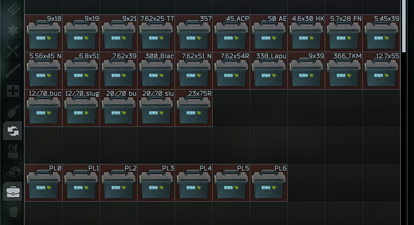
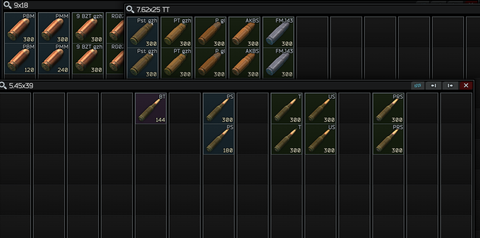

# description
ammunition cases that classify by caliber or penetration for SPTarkov

### caliber cases
one colume one sub-kind of the caliber, sort by penetration value desc from left to right

some empty grid can not put anything, it's intentional for future updates

### penetration level cases
the case can be store any ammo with same penetration range

### extended case
just an extened case that have 196 cells, can store any ammo

### ammo background color
|penetration|color|
|-|-|
|40mm|red|
|60+|red|
|51 ~ 59|orange|
|41 ~ 49|yellow|
|31 ~ 39|violet|
|20 ~ 29|blue|
|10 ~ 19|green|
|01 ~ 09|grey|
|0-|black|

# how to get
- available at REF LL1 and Level 15, cost GP coins

# install
unarchive released zip file and put them in your SPTarkov game folder like `C:\EscapeFromTarkov`, it is should be have the file `EscapeFromTarkov.exe` there.

# preview
### list

### caliber cases

### penetration level cases

