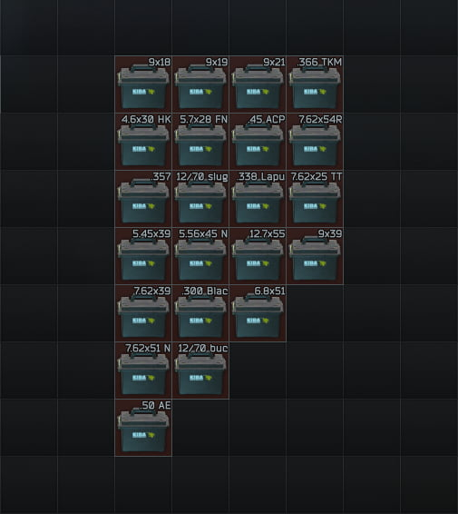
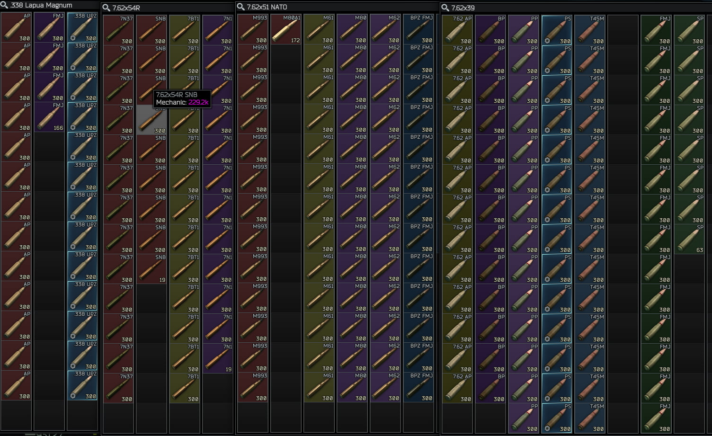

# description
ammunition cases that classify by caliber for SPTarkov

one colume one kind of the caliber, sort by penetration value desc from left to right

some empty grid can not put anything, it's intentional for future updates

available at MECHANIC LL2, cost 500000 RUB

available at REF LL1, cost 66 GP (1 GP = 7500 RUB at now)

# install
unarchive released zip file and put them in your SPTarkov game folder like `C:\EscapeFromTarkov`, it is should be have the file `SPT.Server.exe` there.

# preview
### list

### container

