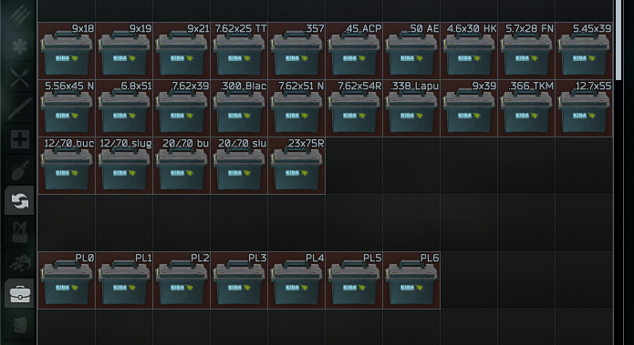
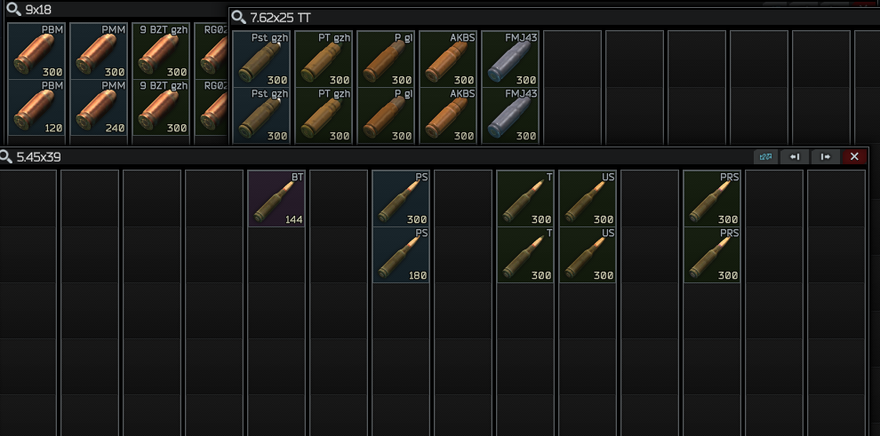
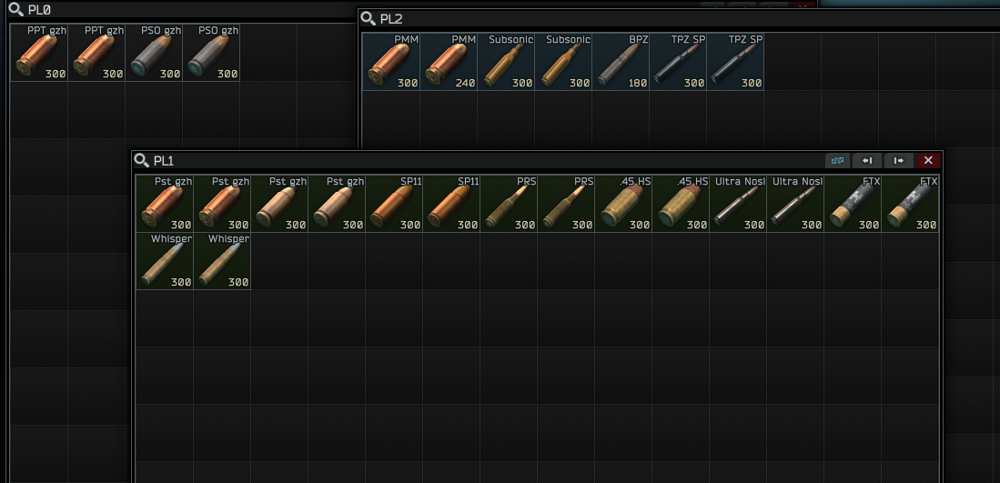

# description
ammunition cases that classify by caliber or penetration for SPTarkov

### caliber cases
one colume one sub-kind of the caliber, sort by penetration value desc from left to right

some empty grid can not put anything, it's intentional for future updates

### penetration level cases
the case can be store any ammo with same penetration range

### ammo background color
only enable when your **mods** folder not include any one of these
- rairaitheraichu-ammostats
- odt-iteminfo
- zzacidphantasm-itemvaluation
- refringe-easyammunition

|penetration|color|
|-|-|
|61 ~ ∞+、40mm|red|
|51 ~ 60|orange|
|41 ~ 50|yellow|
|31 ~ 40|violet|
|21 ~ 30|blue|
|11 ~ 20|green|
|01 ~ 10|grey|
|0、others|black|

# how to get
- available at MECHANIC LL2, cost 500000 RUB
- available at REF LL1, cost 66 GP (1 GP = 7500 RUB at now)

# install
unarchive released zip file and put them in your SPTarkov game folder like `C:\EscapeFromTarkov`, it is should be have the file `SPT.Server.exe` there.

# preview
### list

### caliber cases

### penetration level cases

